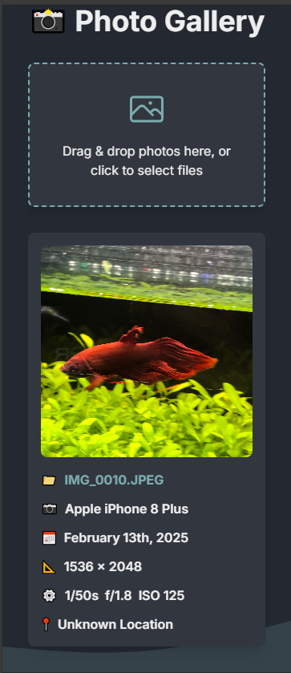

# 📸 Photo Gallery App

A modern, responsive photo gallery application built with Next.js and TypeScript that allows users to upload and view photos with their metadata.



## ✨ Features

- 🖼️ Modern and minimal design with a beautiful color palette
- 📤 Drag and drop file upload
- 📊 Display detailed photo information:
  - 📷 Camera model
  - 📅 Upload date
  - 📐 Image dimensions
  - ⚙️ Camera settings (exposure time, f-number, ISO)
  - 📍 Location data
- 🎯 EXIF data extraction
- 🗑️ Easy photo deletion
- 📱 Fully responsive design
- 🌊 Aesthetic wave animation
- 🎨 Custom color scheme:
  - Background: `#222831`
  - Cards: `#31363F`
  - Accents: `#76ABAE`
  - Text: `#EEEEEE`

## 🚀 Getting Started

### Prerequisites

- Node.js (version 14 or higher)
- npm or yarn

### Installation

1. Clone the repository:
```bash
git clone https://github.com/yourusername/photo-gallery.git
cd photo-gallery
```

2. Install dependencies:
```bash
npm install
# or
yarn install
```

3. Run the development server:
```bash
npm run dev
# or
yarn dev
```

4. Open [http://localhost:3000](http://localhost:3000) in your browser.

## 💻 Usage

1. 📤 **Upload Photos**:
   - Click the upload area or drag and drop photos
   - Supports JPEG, PNG, and GIF formats

2. 👀 **View Photos**:
   - Photos are displayed in a responsive grid
   - Hover over photos to see additional options

3. 🗑️ **Delete Photos**:
   - Hover over a photo and click the delete icon
   - Photo will be removed instantly

## 🛠️ Built With

- [Next.js](https://nextjs.org/) - React framework
- [TypeScript](https://www.typescriptlang.org/) - Programming language
- [Tailwind CSS](https://tailwindcss.com/) - CSS framework
- [React Dropzone](https://react-dropzone.js.org/) - File upload
- [EXIF-js](https://github.com/exif-js/exif-js) - EXIF data extraction
- [date-fns](https://date-fns.org/) - Date formatting
- [Heroicons](https://heroicons.com/) - Icons

## 📝 Project Structure

```
photo-gallery/
├── src/
│   ├── app/
│   │   ├── page.tsx      # Main gallery component
│   │   ├── layout.tsx    # App layout
│   │   └── globals.css   # Global styles
│   └── components/       # React components
├── public/              # Static files
└── package.json        # Dependencies
```

## 🎨 Color Scheme

The application uses a carefully selected color palette:

- `#222831` - Dark background providing excellent contrast
- `#31363F` - Subtle card backgrounds
- `#76ABAE` - Accent color for interactive elements
- `#EEEEEE` - Light text for readability

## 🔜 Future Enhancements

- 🔍 Search and filter functionality
- 📂 Album organization
- 🔄 Batch upload and delete
- 🌍 Geolocation mapping
- 💾 Cloud storage integration
- 🔒 User authentication

## 📄 License

This project is licensed under the MIT License - see the [LICENSE](LICENSE) file for details.

## 👥 Contributing

Contributions are welcome! Please feel free to submit a Pull Request.

1. Fork the project
2. Create your feature branch (`git checkout -b feature/AmazingFeature`)
3. Commit your changes (`git commit -m 'Add some AmazingFeature'`)
4. Push to the branch (`git push origin feature/AmazingFeature`)
5. Open a Pull Request

## 📞 Contact

Your Name - [@yourtwitter](https://twitter.com/yourtwitter)

Project Link: [https://github.com/yourusername/photo-gallery](https://github.com/yourusername/photo-gallery)
